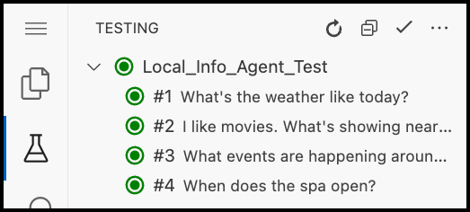

# Agentforce DX - TDX26 Demo

This demo showcases the suite of Agentforce DX Pro-Code Developer Tools.

---

## Introduce Agent Script
* Scripting language for defining Salesforce AI agents
* Two-phase execution: deterministic resolution, then LLM reasoning
* One `.agent` file contains the full definition

## Preview an Agent Using VS Code
```
What's the weather like today?
```
## Ask AFV to Diagnose Agent Behavior
```
Read the agentforce-development skill, then preview the local info agent to ask about the weather. Tell me if anything seems strange.
```
## Ask AFV to Change Agent Behavior
```
Can you make the agent answer weather questions like SOMETHING_FUN instead?
```
## View Agent Tests in VS Code


## Run Agent Tests Using the CLI
```bash
sf agent test run --api-name Local_Info_Agent_Test --wait 5
```

---

# Other Useful Commands

## Preview an Agent Using the CLI
```bash
sf agent preview --use-live-actions --authoring-bundle Local_Info_Agent
```
## Update Agent Tests
```bash
sf agent test create --api-name Local_Info_Agent_Test --spec specs/Local_Info_Agent-testSpec.yaml --force-overwrite 
```
## Fetch Agent Test Results From a Previous Run
```bash
sf agent test results --job-id xxxxxx --json
```
---

# Demo Management Commands

## Reset the Demo
```bash
./setup
```
## Update the `agent` plugin
```bash
sf plugins install agent@latest
```
## Get the latest changes and tags
```bash
git pull --tags --force
```