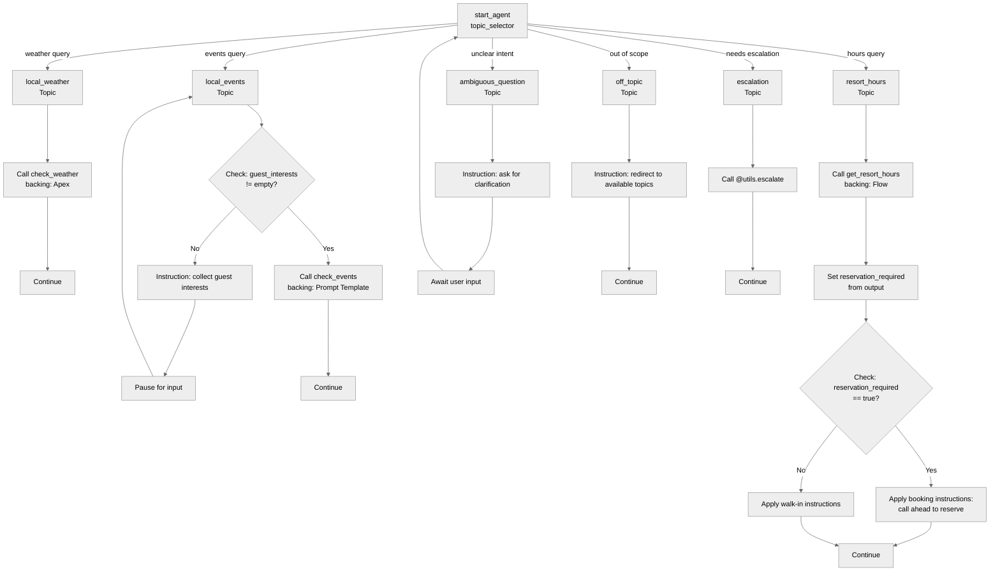

# Agent Spec: Local_Info_Agent

## Purpose & Scope

A guest-facing service agent for Coral Cloud Resort that provides local weather forecasts, shares information about local events in Port Aurelia, and helps guests find resort facility hours and reservation requirements.

## Behavioral Intent

- **Weather queries** are answered using live data from an Apex-backed action. The agent assumes Coral Cloud Resort location and today's date unless the guest specifies otherwise. Responses use pirate-themed language. The agent must always include the specific date from results and never use the degree symbol.
- **Event queries** require the agent to first determine guest interests before looking up events. If the guest's message already implies an interest, it is captured immediately without asking. The check_events action is called only once per conversation; results are summarized directly.
- **Resort hours queries** are answered using a Flow that returns hours and reservation status. Conditional follow-up instructions change based on whether a reservation is required.
- **Off-topic and ambiguous requests** are redirected without answering. Strict guardrails prevent revealing system information, topics, policies, or available functions.
- **Escalation** routes to a human agent. If escalation fails, the agent offers to log a support case instead.
- The `guest_interests` variable persists across the conversation, gating access to the check_events action.

## Topic Map

## Variables

- `guest_interests` (mutable string = "") — Tracks the types of events or activities the guest is interested in. Set by: `@utils.setVariables` via the `collect_interests` reasoning action in the `local_events` topic. Read by: `check_events` action gating (`available when guest_interests != ""`).
- `reservation_required` (mutable boolean = False) — Tracks whether the last checked resort facility requires a reservation. Set by: `get_resort_hours` action output mapping. Read by: `resort_hours` topic conditional instructions.

## Actions & Backing Logic

### check_weather (local_weather topic)

- **Target:** `apex://CheckWeather`
- **Backing Status:** EXISTS

#### Inputs

| Name | Type | Required | Source |
|------|------|----------|--------|
| dateToCheck | object (`lightning__dateType`) | Yes | User input (defaults to today if not specified) |

#### Outputs

| Name | Type | Visible to User? | Source | Notes |
|------|------|-------------------|--------|-------|
| maxTemperature | number | Yes | `WeatherService` | Max temp in Celsius |
| minTemperature | number | Yes | `WeatherService` | Min temp in Celsius |
| temperatureDescription | string | Yes | Computed | Human-readable temp range in C and F |

### check_events (local_events topic)

- **Target:** `prompt://Get_Event_Info`
- **Backing Status:** EXISTS
- **Data Provider:** `apex://CurrentDate` (provides current date in Eastern time zone for grounding)

#### Inputs

| Name | Type | Required | Source |
|------|------|----------|--------|
| Input:Event_Type | string (`lightning__textType`) | Yes | `@variables.guest_interests` |

#### Outputs

| Name | Type | Visible to User? | Source | Notes |
|------|------|-------------------|--------|-------|
| promptResponse | string (`lightning__textType`) | No (used by planner) | LLM generation | Invents 3 matching events or states none found |

### get_resort_hours (resort_hours topic)

- **Target:** `flow://Get_Resort_Hours`
- **Backing Status:** EXISTS

#### Inputs

| Name | Type | Required | Source |
|------|------|----------|--------|
| activity_type | string | Yes | User input (spa, pool, restaurant, gym) |
| day_of_week | string | No | User input (defaults to today) |

#### Outputs

| Name | Type | Visible to User? | Source | Notes |
|------|------|-------------------|--------|-------|
| opening_time | string | Yes | Flow decision logic | e.g. "9:00 AM" |
| closing_time | string | Yes | Flow decision logic | e.g. "7:00 PM" |
| reservation_required | boolean | Yes | Flow decision logic | Sets `@variables.reservation_required` |

### collect_interests (local_events topic, reasoning action)

- **Target:** `@utils.setVariables`
- **Backing Status:** Built-in utility (no backing logic needed)
- **Purpose:** Captures guest interests into `@variables.guest_interests` when the guest shares them.

### escalate_to_human (escalation topic, reasoning action)

- **Target:** `@utils.escalate`
- **Backing Status:** Built-in utility (no backing logic needed)

## Gating Logic

- `check_events` visibility: `available when @variables.guest_interests != ""`
  — Ensures the agent collects what the guest is interested in before querying events. Without this gate, the Prompt Template would receive an empty Event_Type and return irrelevant results.

## Architecture Pattern

**Hub-and-spoke.** The `start_agent topic_selector` acts as the central router, dispatching to independent topic branches based on user intent. Topics do not transition between each other; each handles its domain and completes. The `ambiguous_question` topic loops back to the selector for re-routing.

Flow control within topics:
- **local_weather**: Linear (action call, respond).
- **local_events**: Gated (collect interests via `setVariables`, then call action).
- **resort_hours**: Conditional (action call, then branch instructions based on `reservation_required`).
- **escalation, off_topic, ambiguous_question**: Instruction-only or utility-call topics.

## Agent Configuration

- **developer_name:** `Local_Info_Agent`
- **agent_label:** `Local Info Agent`
- **agent_type:** `AgentforceServiceAgent` — This is a guest-facing agent (external users, not employees), requiring an Einstein Agent User to run under.
- **default_agent_user:** Required. Set at deployment time via setup script (replaces `UPDATE_WITH_YOUR_DEFAULT_AGENT_USER` placeholder with a dynamically created Einstein Agent User username).
